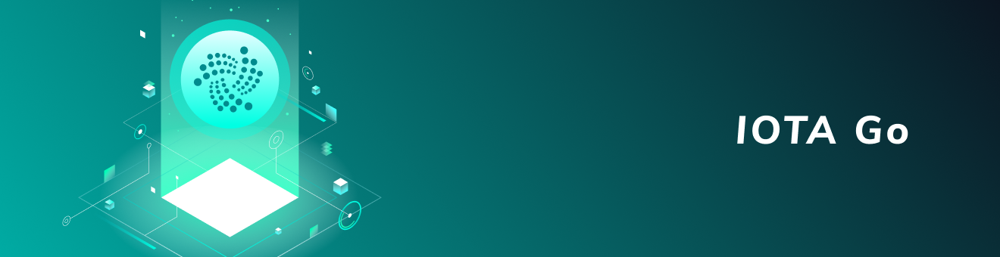

<h1 align="center">
  <br>
  <a href="https://docs.iota.org/docs/client-libraries/0.1/getting-started/go-quickstart"></a>
</h1>

<h2 align="center">The official Go client library for interacting with the Tangle</h2>

<p align="center">
    <a href="https://docs.iota.org/docs/client-libraries/0.1/getting-started/go-quickstart" style="text-decoration:none;">
    
      </p>
<p align="center">
	<a href="https://godoc.org/github.com/iotaledger/iota.go" style="text-decoration:none;"></a>
	<a href="https://discord.iota.org/" style="text-decoration:none;"></a>
    <a href="https://iota.stackexchange.com/" style="text-decoration:none;"></a>
    <a href="https://raw.githubusercontent.com/iotaledger/iota.go/master/LICENSE" style="text-decoration:none;"></a>
    <a href="https://docs.iota.org/docs/node-software/0.1/iri/references/api-reference" style="text-decoration:none;"></a>
    <a href="https://goreportcard.com/report/github.com/iotaledger/iota.go" style="text-decoration:none;"></a>
    <a href="https://travis-ci.org/iotaledger/iota.go" style="text-decoration:none;"></a>
</p>
      
<p align="center">
  <a href="#about">About</a> ◈
  <a href="#prerequisites">Prerequisites</a> ◈
  <a href="#installation">Installation</a> ◈
  <a href="#getting-started">Getting started</a> ◈
  <a href="#api-reference">API reference</a> ◈
  <a href="#examples">Examples</a> ◈
  <a href="#supporting-the-project">Supporting the project</a> ◈
  <a href="#joining-the-discussion">Joining the discussion</a> 
</p>

---

## About

This is the **official** Golang client library, which allows you to do the following:
* Create transactions
* Read transactions
* Sign transactions
* Generate addresses

This is beta software, so there may be performance and stability issues.
Please report any issues in our [issue tracker](https://github.com/iotaledger/iota.go/issues/new).

## Prerequisites

To install the IOTA Go client library and its dependencies, we recommend that you use [vgo modules](https://github.com/golang/go/wiki/Modules) 
(since Go 1.11) to manage dependencies in your project.

## Installation

To download the IOTA Go client library and its dependencies, do the following:

1. In any directory outside of GOPATH, initiate your project:

	```bash
	$ go mod init <your-module-path>
	```

**Note:** Change the <your-module-path> placeholder to your chosen path such as github.com/me/awesome-project.

2. Download the library:

	```bash
	$ go get github.com/iotaledger/iota.go/api
	```

This command downloads the latest version of the IOTA Go client library and writes the version into
the `go.mod` file (vgo is `go get` agnostic).

## Getting started

After you've [downloaded the library](#installation), you can connect to an IRI node to send transactions to it and interact with the ledger.
An extended guide can be found on our [documentation portal](https://docs.iota.org/docs/client-libraries/0.1/getting-started/go-quickstart), we strongly recommend you to go here for starting off. A quick starting tutorial is shown below.

1. To connect to a local IRI node, do the following:

	```go
	package main

	import (
	    . "github.com/iotaledger/iota.go/api"
	    "fmt"
	)

	var endpoint = "<node-url>"

	func main() {
		// compose a new API instance
		api, err := ComposeAPI(HTTPClientSettings{URI: endpoint})
		must(err)

		nodeInfo, err := api.GetNodeInfo()
		must(err)

		fmt.Println("latest milestone index:", nodeInfo.LatestMilestoneIndex)
	}

	func must(err error) {
		if err != nil {
			panic(err)
		}
	}
	```
## API reference

For details on all available API methods, see the [API folder](api/).
	
## Examples

We have a list of test cases in the [`examples` directory](api/.examples) that you can use as a reference when developing apps with IOTA.

Here's how you could send a zero-value transaction, using the library. For the guide, see the [documentation portal](https://docs.iota.org/docs/client-libraries/0.1/how-to-guides/go/send-your-first-bundle).

```go
var node = "https://nodes.devnet.thetangle.org"

// Define a seed and an address.
// These do not need to belong to anyone or have IOTA tokens.
// They must only contain a maximum of 81 trytes
// or 90 trytes with a valid checksum
const seed = trinary.Trytes("JBN9ZRCOH9YRUGSWIQNZWAIFEZUBDUGTFPVRKXWPAUCEQQFS9NHPQLXCKZKRHVCCUZNF9CZZWKXRZVCWQ")
const address = trinary.Trytes("XBN9ZRCOH9YRUGSWIQNZWAIFEZUBDUGTFPVRKXWPAUCEQQFS9NHPQLXCKZKRHVCCUZNF9CZZWKXRZVCWQMZOCAHYPD")

// Define a message to send.
// This message must include only ASCII characters.
var data = "{'message' : 'Hello world'}"

const minimumWeightMagnitude = 9
const depth = 3

func main() {
    // compose a new API instance, we provide no PoW function so this uses remote PoW
    api, err := ComposeAPI(HTTPClientSettings{URI: node})
    must(err)

    // Convert the message to trytes
    message, err := converter.ASCIIToTrytes(data)
    must(err)

    // Define a zero-value transaction object
    // that sends the message to the address
    transfers := bundle.Transfers{
        {
            Address: address,
            Value: 0,
            Message: message,
        },
    }
    // Use the default options
    prepTransferOpts := PrepareTransfersOptions{}

    trytes, err := api.PrepareTransfers(seed, transfers, prepTransferOpts)
    must(err)
    
    // Create a bundle from the `transfers` object
    // and send the transaction to the node
    myBundle, err := api.SendTrytes(trytes, depth, minimumWeightMagnitude)
    must(err)

    fmt.Println("Bundle hash: " + myBundle[0].Bundle)
}

func must(err error) {
    if err != nil {
        panic(err)
    }
}
```

### Native code and PoW

If the library is compiled with CGO enabled, certain functions such as Curl's `transform()` method will
run native C code for increased speed. 

Certain PoW implementations are enabled if the correct flags are passed while compiling your program:

* `pow_avx` for AVX based PoW
* `pow_sse` for SSE based PoW
* `pow_c128` for C int128 based using PoW
* `pow_arm_c128` for ARM64 int128 C based PoW
* `pow_c` for C based PoW

If you want to use local PoW, make sure you define `LocalProofOfWorkFunc` in your provider settings such as `HTTPClientSettings`. 

## Supporting the project

We thank everyone for their contributions. In order for your pull requests to be accepted, they must fulfill the following criteria:
* You must write tests for your additions with Ginkgo
* You must write example code that desribes the parameters and the functionality of your additions 
* Your pull request must pass the continuous integration configuration

See the [contributing guidelines](.github/CONTRIBUTING.md) for more information.

### Writing tests with Ginkgo

Before your pull requests can be accepted, you must test your code in Ginkgo.

1. Download Ginkgo:

	```bash
	$ go get github.com/onsi/ginkgo/ginkgo
	$ go get github.com/onsi/gomega/...
	```

2. If you've written a new package, generate a corresponding test-suite file:

	```bash
	$ cd <dir-of-your-package>
	$ ginkgo bootstrap
	```

3. Generate a new testing file:

	```bash
	$ ginkgo generate <package-name>
	```

After creating a testing file, you'll have following two files:

* <package-name>_suite_test.go
* <package-name>_test.go

**Note:** You can use the existing tests as a reference on how to write Ginkgo tests or
you can [read the documentation](https://onsi.github.io/ginkgo/).

4. Run your tests:

	```bash
	$ go test -v
	=== RUN   TestAddress
	Running Suite: Address Suite
	============================
	Random Seed: 1542616006
	Will run 11 of 11 specs

	•••••••••••
	Ran 11 of 11 Specs in 0.261 seconds
	SUCCESS! -- 11 Passed | 0 Failed | 0 Pending | 0 Skipped
	--- PASS: TestAddress (0.26s)
	PASS
	ok  	github.com/iotaledger/iota.go/address	0.264s
	```

### Writing documentation and example code

While godoc.org gives a good enough documentation of the package already, the IOTA Foundation's
documentation portal needs additional information, such as parameter description, examples and so on.

1. If non existent, add a `.examples` directory in your newly created package

2. Create a new file with the following convention: `<package-name>_examples_test.go` inside
the `.examples` directory

3. Write examples in the following schema:
```
// i req: s, The ASCII string to convert to Trytes.
// o: Trytes, The Trytes representation of the input ASCII string.
// o: error, Returned for non ASCII string inputs.
func ExampleASCIIToTrytes() {
	trytes, err := converter.ASCIIToTrytes("IOTA")
	if err != nil {
		// handle error
		return
	}
	fmt.Println(trytes) // output: "SBYBCCKB"
}
```

| Symbol     | Description |
|:---------------|:--------|
| i req | Describes a parameter to the function. |
| i | Describes an optional parameter to the function. |
| o | Describes a return value of the function. |

Syntax:

* For parameters: `<symbol>: <parameter_name>, <description>.`  
* For return values: `<symbol>: <type>, <description>.`
* Example function: `Example<OriginFunctionName>`

## Joining the discussion

If you want to get involved in the community, need help with getting setup, have any issues related with the library or just want to discuss blockchain, distributed ledgers, and IoT with other people, feel free to join our [Discord](https://discord.iota.org/).
